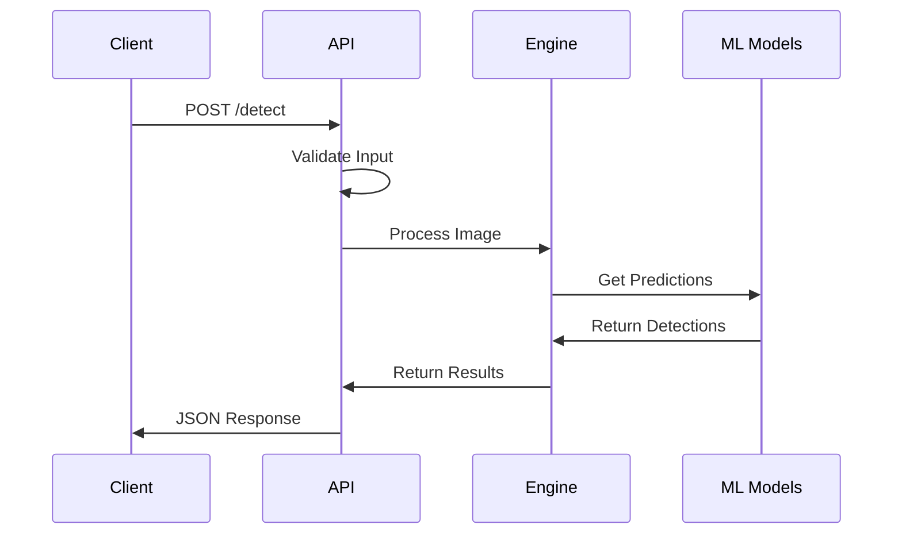
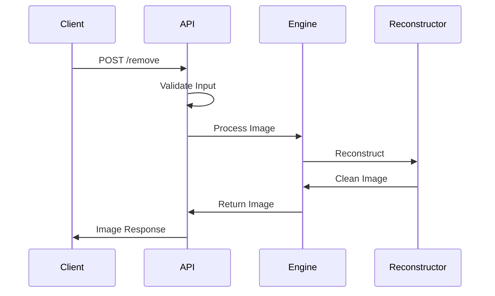

# Architecture

Ce document décrit l'architecture détaillée du projet Watermark Evil.

## Vue d'Ensemble

Le projet est construit autour de trois composants principaux :
1. Engine (Rust)
2. ML Models (Python)
3. API Layer (Python/FastAPI)

## Composants Détaillés

### 1. Engine

#### Detection Engine

```rust
pub struct DetectionEngine {
    models: Vec<Box<dyn WatermarkDetector>>,
    config: DetectionConfig,
}
```

Responsable de :
- Validation des images
- Orchestration des modèles
- Optimisation CUDA
- Gestion mémoire

#### Reconstruction Engine

```rust
pub struct ReconstructionEngine {
    model: Box<dyn ImageReconstructor>,
    optimizer: Box<dyn ImageOptimizer>,
}
```

Responsable de :
- Reconstruction d'image
- Inpainting
- Optimisation qualité
- Gestion mémoire GPU

#### Optimization Engine

```rust
pub struct OptimizationEngine {
    cuda_context: Option<CudaContext>,
    memory_pool: GpuMemoryPool,
}
```

Responsable de :
- Optimisation GPU
- Gestion mémoire
- Fallback CPU
- Métriques performance

### 2. ML Models

#### Base Model

```python
class BaseModel(nn.Module):
    def __init__(self, config: ModelConfig):
        self.config = config
        self.device = torch.device(config.device)
```

Caractéristiques :
- Configuration flexible
- Gestion GPU/CPU
- Métriques intégrées
- Validation architecture

#### Detectors

```python
class BaseDetector(BaseModel):
    def process_detections(
        self,
        raw_outputs: torch.Tensor,
        confidence_threshold: float
    ) -> List[Detection]
```

Types de détecteurs :
- Logo Detector
- Text Detector
- Pattern Detector

#### Training

```python
class ModelTrainer:
    def __init__(
        self,
        model: BaseModel,
        config: TrainingConfig,
        callbacks: Dict[str, Callable]
    ):
```

Fonctionnalités :
- Early stopping
- Checkpointing
- Métriques training
- Callbacks

### 3. API Layer

#### Validation

```python
async def validate_image_file(
    file: UploadFile
) -> ImageMetadata:
    """Validate uploaded image file"""
```

Validations :
- Taille fichier
- Format image
- Dimensions
- Type MIME

#### Rate Limiting

```python
class RateLimiter:
    def __init__(self):
        self.default_limits = {
            "anonymous": RateLimit(100, 3600),
            "authenticated": RateLimit(1000, 3600)
        }
```

Caractéristiques :
- Token bucket
- Limites par IP
- Burst allowance
- Ban automatique

#### Concurrency

```python
class ConcurrencyManager:
    def __init__(
        self,
        max_concurrent_tasks: int = 10
    ):
```

Gestion de :
- Tâches concurrentes
- Timeouts
- Ressources
- Nettoyage

#### Error Handling

```python
class APIError(Exception):
    def __init__(
        self,
        code: ErrorCode,
        message: str,
        status_code: int = 400
    ):
```

Types d'erreurs :
- Validation
- Rate Limit
- Concurrency
- Processing

## Flux de Données

### Detection Flow



### Reconstruction Flow



## Monitoring

### Métriques

```python
# Engine metrics
gauge("engine.cuda.memory_used_mb", used_mb)
histogram("engine.detection.time_ms", duration)

# ML metrics
gauge("ml.model.parameters", num_params)
counter("ml.training.iterations", 1)

# API metrics
gauge("api.concurrent_requests", num_requests)
counter("api.errors", 1, tags={"type": "validation"})
```

### Logging

```python
logger.info("Processing request", extra={
    "request_id": "123",
    "client_ip": "1.2.3.4",
    "image_size": "1.5MB"
})
```

## Sécurité

### Validation

- Taille maximale fichier : 10MB
- Formats supportés : JPG, PNG, WebP
- Dimensions max : 4096x4096

### Rate Limiting

- Anonymous : 100 req/hour
- Authenticated : 1000 req/hour
- Burst : 10% de la limite

### Concurrence

- Max tasks : 10
- Timeout : 300s
- Cleanup : 1h

## Performance

### Optimisations

1. **GPU**
   - Batch processing
   - Memory pooling
   - Stream processing
   - Async transfers

2. **CPU**
   - Thread pooling
   - SIMD operations
   - Cache optimization
   - Load balancing

3. **API**
   - Connection pooling
   - Response caching
   - Async processing
   - Resource limits

## Dépendances

### Rust

```toml
[dependencies]
opencv = "0.63"
tokio = { version = "1.0", features = ["full"] }
image = "0.24"
```

### Python

```toml
[tool.poetry.dependencies]
torch = "^1.10"
fastapi = "^0.68"
opencv-python-headless = "^4.5"
```

## Configuration

### Engine

```toml
[engine]
cuda_enabled = true
num_threads = 4
memory_limit_mb = 1024

[detection]
batch_size = 16
confidence_threshold = 0.5
```

### ML

```python
MODEL_CONFIG = {
    "input_size": (512, 512),
    "batch_size": 16,
    "learning_rate": 1e-4
}
```

### API

```python
API_CONFIG = {
    "max_request_size_mb": 10,
    "timeout_seconds": 300,
    "cleanup_interval": 3600
}
```
