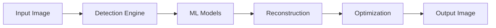

# Watermark Evil

Un moteur avancé de détection et suppression de filigranes utilisant des techniques de ML.

## 🚀 Fonctionnalités

- **Détection Multi-modèle** : Détection de logos, textes et motifs
- **Reconstruction Intelligente** : Reconstruction d'image sans perte de qualité
- **Optimisation GPU** : Support CUDA pour des performances maximales
- **API RESTful** : Interface HTTP simple et robuste
- **Monitoring Complet** : Métriques détaillées et logging

## 📋 Prérequis

- Python 3.8+
- Rust 1.54+
- CUDA 11.0+ (optionnel)
- OpenCV 4.5+

## 🛠️ Installation

1. Cloner le dépôt :
```bash
git clone https://github.com/votre-org/watermark-evil.git
cd watermark-evil
```

2. Installer les dépendances Python :
```bash
pip install -r requirements.txt
```

3. Compiler le code Rust :
```bash
cargo build --release
```

## 🎯 Utilisation

### CLI

```bash
# Détecter les filigranes
watermark detect image.jpg

# Supprimer les filigranes
watermark remove image.jpg --output clean.jpg

# Optimiser une image
watermark optimize image.jpg --quality 0.8
```

### API

```python
from watermark_evil import WatermarkDetector, ImageReconstructor

# Détecter
detector = WatermarkDetector()
detections = detector.detect("image.jpg")

# Reconstruire
reconstructor = ImageReconstructor()
clean_image = reconstructor.remove(
    "image.jpg",
    detections=detections
)
```

## 🏗️ Architecture

### Composants Principaux

1. **Engine** (`src/engine/`)
   - `detection/` : Moteur de détection
   - `reconstruction/` : Moteur de reconstruction
   - `optimization/` : Moteur d'optimisation

2. **ML** (`src/ml/`)
   - `models/` : Modèles ML
   - `training/` : Entraînement
   - `config.py` : Configuration ML

3. **API** (`src/api/`)
   - `validation.py` : Validation des entrées
   - `rate_limiter.py` : Rate limiting
   - `concurrency.py` : Gestion concurrence
   - `errors.py` : Gestion erreurs

### Flux de Données



## 🔧 Configuration

### Engine

```toml
[engine]
max_image_size = 4096
cuda_enabled = true
num_threads = 4

[detection]
confidence_threshold = 0.5
iou_threshold = 0.45
```

### ML

```python
LOGO_DETECTOR_CONFIG = DetectorConfig(
    name="logo_detector",
    version="1.0.0",
    input_size=(512, 512),
    batch_size=16
)
```

### API

```python
RATE_LIMITS = {
    "anonymous": RateLimit(100, 3600),
    "authenticated": RateLimit(1000, 3600)
}
```

## 📊 Monitoring

### Métriques Disponibles

- **Engine**
  - `engine.detection.time_ms`
  - `engine.reconstruction.time_ms`
  - `engine.optimization.time_ms`
  - `engine.cuda.memory_used_mb`

- **ML**
  - `ml.model.inference_time_ms`
  - `ml.training.loss`
  - `ml.gpu.memory_allocated`

- **API**
  - `api.requests_total`
  - `api.errors_total`
  - `api.processing_time_ms`

### Logging

```python
logger.info("Processing image", extra={
    "image_id": "123",
    "size_mb": 1.5,
    "cuda_available": True
})
```

## 🧪 Tests

```bash
# Tests unitaires
pytest tests/

# Tests d'intégration
cargo test --release

# Couverture
pytest --cov=src tests/
```

## 📝 API Reference

Voir [api.yaml](api.yaml) pour la documentation OpenAPI complète.

## 🤝 Contribution

1. Fork le projet
2. Créer une branche (`git checkout -b feature/amazing`)
3. Commit les changements (`git commit -m 'feat: Add something amazing'`)
4. Push la branche (`git push origin feature/amazing`)
5. Ouvrir une Pull Request

## 📄 Licence

Ce projet est sous licence MIT - voir le fichier [LICENSE](LICENSE) pour plus de détails.

## 🙏 Remerciements

- OpenCV pour le traitement d'image
- PyTorch pour le ML
- FastAPI pour l'API
- Tous les contributeurs
